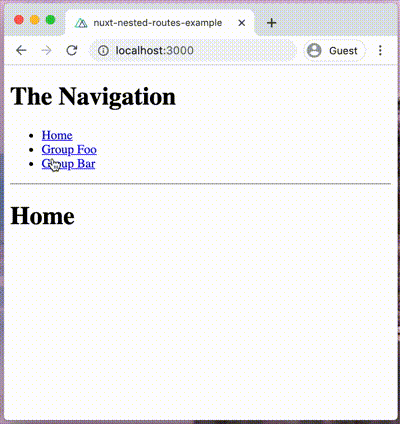

# Nuxt.js Nested Routes Example

An example Nuxt.js project for nested routes (pages) including:

* [Nested Routes](https://nuxtjs.org/guide/routing#nested-routes) (Using `<nuxt-child>`)
* [Page transition](https://nuxtjs.org/api/pages-transition/) (Using `transition` property)



## Build Setup

``` bash
# install dependencies
$ yarn install

# serve with hot reload at localhost:3000
$ yarn dev

# build for production and launch server
$ yarn build
$ yarn start

# generate static project
$ yarn generate
```

For detailed explanation on how things work, check out [Nuxt.js docs](https://nuxtjs.org).
